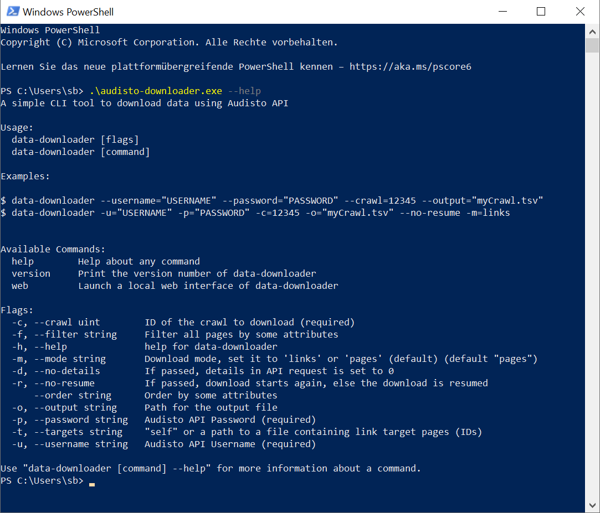
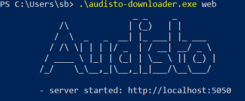
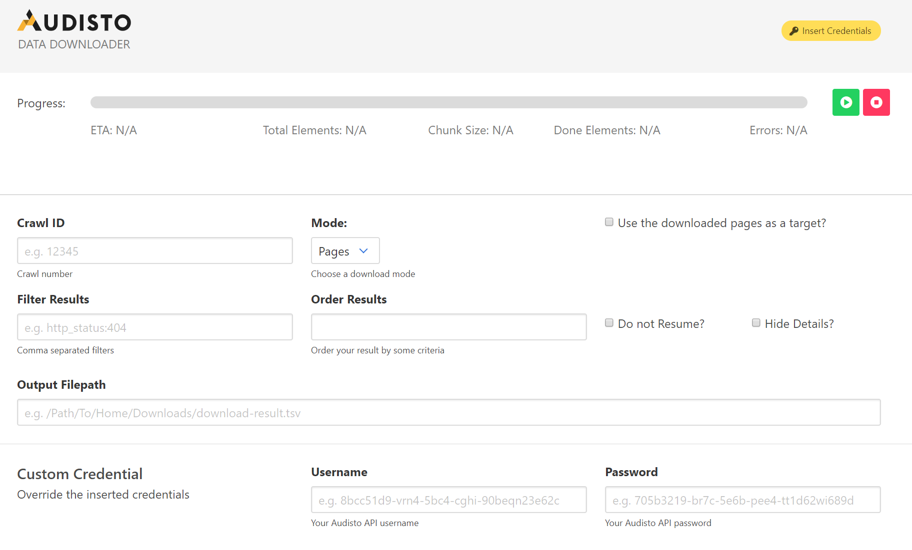

# Audisto Data-Downloader

[](https://travis-ci.org/audisto/data-downloader)
 [](https://godoc.org/github.com/audisto/data-downloader)
 [](https://goreportcard.com/report/github.com/audisto/data-downloader)

A command line tool for easy data downloads, even for very large Gigabyte files, using the [Audisto](https://audisto.com/) API. The data-downloader will automatically combine all chunks into one file.

## Usage

Instructions:

```text
Usage: data-downloader [OPTIONS]

Parameters:
  -u, --username=[USERNAME]     Audisto API Username (required)
  -p, --password=[PASSWORD]     Audisto API Password (required)
  -c, --crawl=[ID]              ID (uint) of the crawl to download (required)
  -f, --filter=[FILTER]         Filter all pages by given FILTER
  -h, --help                    help for data-downloader
  -m, --mode=[pages/links]      Download mode, set it to 'links' or 'pages' (default)
  -d, --no-details              If passed, details in API request is set to 0
  -r, --no-resume               If passed, download starts again, else the download is resumed
      --order=[ORDER]           all pages are ordered by given ORDER
  -o, --output=[FILE]           Path for the output file
  -t, --targets=[self/FILE]     "self" or a path to a FILE containing link target pages (IDs)
```

Examples to start a new download or resume a download with all details, using long or short versions:

```shell
data-downloader --username="USERNAME" --password="PASSWORD" --crawl=12345 --output="myCrawl.tsv"
data-downloader -u="USERNAME" -p="PASSWORD" -c=12345 -o="myCrawl.tsv"
```

### Debug / Verbose mode

You can make the tool verbose about what is exactly performing, and what requests are being sent to Audisto API by setting `DD_DEBUG` (short for data-downloader debug) environment variable to `1` or `true` in your current terminal session.

```text
DD_DEBUG=true data-downloader [flags]
```

## Installation

You may download the latest compiled executables from the [releases section](https://github.com/audisto/data-downloader/releases). Even beta versions are very stable - you should always download the latest version. Download the version for your OS (Windows, Mac OS or Linux) and maybe rename it for example into `data-downloader`.

Hint for Macintosh Users if you can't use the executable because its a .dms:

> A file with a .dms extension is a file that has been downloaded and renamed by the Apple Safari web browser or the Apple Mail email client. It contains the contents of a file that did not have a file extension or was erroneously renamed when downloaded. The .dms extension is a result of a bug in Safari and Mail - you can just rename it.

## Usage by Command-Line

One way to use the data-downloader is by command-line:

For Windows users, you either start a CMD command prompt or right-click your Windows start button, left-hand on your taskbar, and start a "Windows PowerShell". Navigate to the folder with your executable. *Hint: PS will start in your user folder, so an easy way is to just drop the .exe in that folder.*

If you use the PowerShell, instead of a command prompt, you need to prefix the executable with "point and backslash" like this, because its not a Cmdlet:

```powershell
.\data-downloader.exe [OPTIONS]
```



## Usage by Web Interface

A more comfortable way to use the data-downloader is by starting the local web server that provides you with a web interface you can use via any browser. You start the data downloader server by using the "web" option. For Windows PowerShell like this:

```powershell
.\data-downloader.exe web
```

When the server is running you'll see the "server started" message



and now you can access the web interface by copying <http://localhost:5050> into your browser. If you use it often, create a browser bookmark. You will shut down the web service by closing the PowerShell window.

The web interface will offer you all options in an easy to use interface like this:



### Tip: Create a Shortcut to run the Web Server

If you want to use the web interface regularly its a good idea to create a shortcut to run the web server.

For Windows: right-click and create a new shortcut, choose the data-downloader.exe as your target. Now edit the target (right-click the shortcut & select properties):

Change the target line to

```text
cmd /c "C:\PATH\audisto-downloader.exe web"
```

This should be translated by the system later in something like

```text
C:\Windows\System32\cmd.exe /C "C:\PATH\audisto-downloader.exe web"
```

PATH needs to be your own, if you stay in your user folder similar to C:\Users\NAME\

Save the shortcut and you are done. Now you can start the web server with an easy double-click.

## Usage Examples with Parameters

### Example: Download all 404, but add incoming links

Download the 404 by copying the command line from within the Audisto export dialogue including the `--filter=http_status:404` and manually add the targets=self parameter or check the "Use the downloaded pages as a target" in the web interface.

```shell
data-downloader [OPTIONS] --targets=self
```

### Example: Download all 30x Redirects as source and target pages

Download the 301, 302, etc. by using a command line with the proper user and
file options similar to the Audisto export dialogue and manually add the
links mode parameter (or switch the mode in the web interface) and
than add the filter using `--filter=type:30x`.

```shell
data-downloader [OPTIONS] --mode=links --filter=type:30x --no-details
```

Using the `--no-details` is generally encouraged when using `--mode=links`.
If it is omitted, all page related data is added for both source and target pages,
which can become very slow.

*Note: The type 30x is valid to use and also do not confuse e.g.
filter=type:301 (link) with filter=http_status:301 (page).*

## Installation from Source

Install Go:

Install the Go runtime by downloading the latest release from here: <https://golang.org/dl/>

Clone the repository:

```shell
git clone github.com/audisto/data-downloader
```

Compile:

```shell
make build
```
